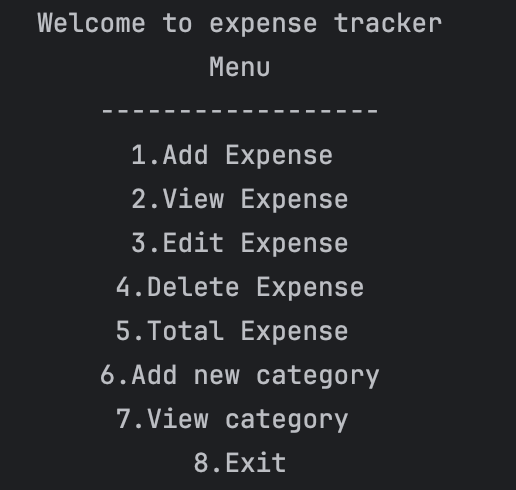
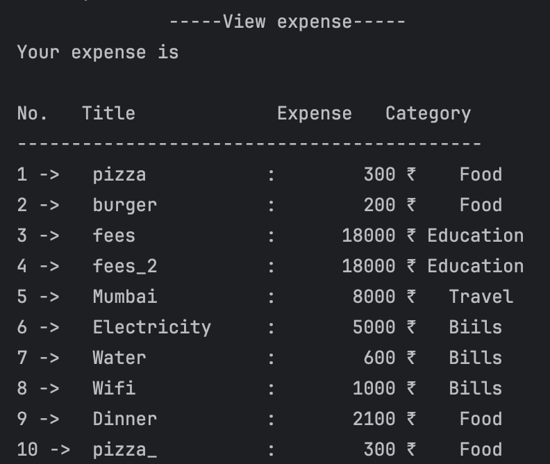

# 💸 Expense Tracker

A **command-line expense management application** built with Python, implementing core programming concepts for practical financial tracking.

---

## 🖼 Screenshots

**Main Menu:**  

**Adding an Expense:**  

## 🌟 Features & Implementation

- **Add Expenses** – Dictionary-based data storage with input validation and error handling.  
- **View Expenses** – File I/O operations to read data with formatted string output in tables.  
- **Edit Expenses** – List indexing and dictionary updates with safe file rewriting.  
- **Delete Expenses** – List operations with confirmation prompts and data integrity checks.  
- **Category Management** – Dynamic list manipulation for custom spending categories.  
- **Calculate Totals** – List comprehension and filtering for category-wise and overall summaries.  
- **Safe File Handling** – Temporary file operations and atomic writes to prevent data corruption.  

---

## 🛠 Core Python Concepts Used

- **File I/O** – Reading from and writing to `expenses.txt` and `categories.txt`.  
- **Data Structures** – Dictionaries for expense records, lists for category management.  
- **Functions** – Modular design with separate functions for each major operation.  
- **Exception Handling** – Custom `invalidAnswerError` class with try-except blocks.  
- **Control Flow** – `while True` menu loops with `match-case` statement navigation.  
- **String Formatting** – Clean tabular output and data parsing for display.  
- **List Operations** – Append, remove, comprehension, and indexing for data management.  
- **Input Validation** – Type checking and range validation for user inputs.  

---

## 📁 File Structure

expense.py              # Main application with all functions
yourExpense.txt         # Expense data storage (auto-created)
categories.txt          # Categories list (auto-created)

---
